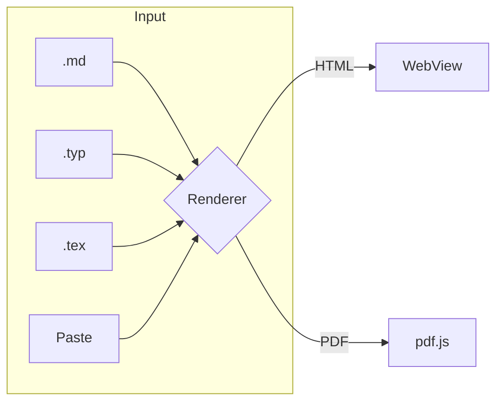
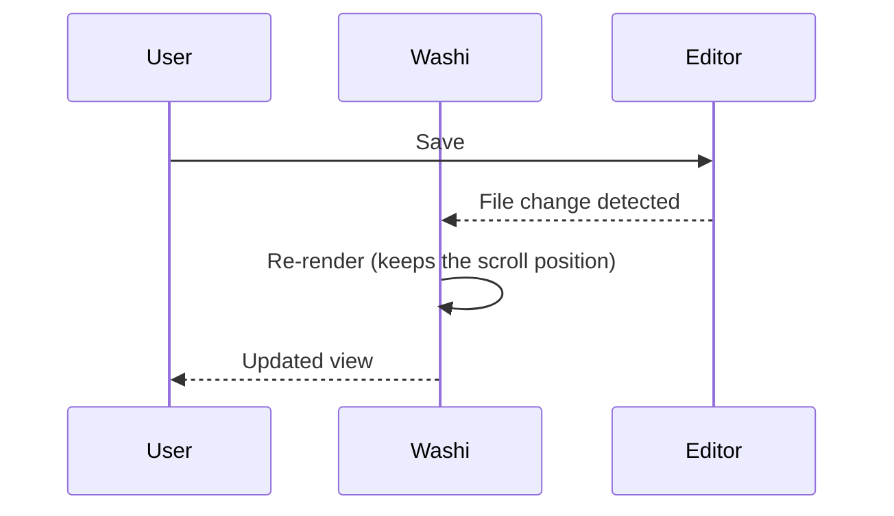
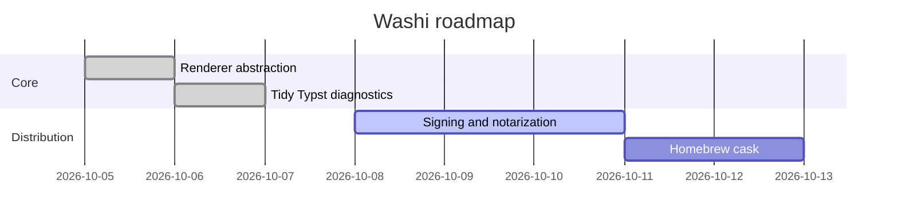
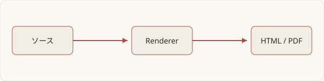

# Washi Showcase

A viewer you can read as quietly as washi paper. This file uses most of the **main Markdown features**.
Links to other examples: [Typst report](report.typ) · [LaTeX paper](paper.tex) · [Mermaid diagram](architecture.mmd) (they open inside Washi when clicked).
External links such as <https://typst.app> open in your browser.

## 1. Text and inline elements

Paragraphs that mix scripts keep their line spacing and line breaking. You can use **bold**, *italic*, ~~strikethrough~~, `inline code`, superscripts like x^2^,
autolinks like https://example.com, and footnotes[^note]. Prices such as \$5 or \$10 are told apart from math with a backslash, while $E = mc^2$ becomes a formula.

> Quotes are shown in a slightly softer color.
>
> > Nested quotes work the same way.

[^note]: Footnotes are collected at the end, each with a link back to the text.

## 2. Lists and tasks

1. Step one
   - A nested bullet
   - Another one
     1. A nested numbered item
     2. The second one
2. Step two

- [x] Open a file
- [x] Re-render automatically on save
- [ ] Quick Look extension (not implemented)

Term
: Definition lists work too.

## 3. Tables

| Format | Rendered as | Speed | Notes |
|:-------|:-----------:|------:|-------|
| Markdown | HTML | Instant | KaTeX and Mermaid supported |
| Typst | PDF | ~50 ms | `@preview` packages work |
| LaTeX | PDF | ~1 s | tectonic / latexmk |
| Mermaid | SVG | Instant | Click a diagram to enlarge it |

## 4. Math

Inline: $\int_0^1 x^2\,dx = \tfrac13$, $\sum_{k=1}^{n} k = \frac{n(n+1)}{2}$.

$$
\begin{aligned}
\nabla \cdot \mathbf{E} &= \frac{\rho}{\varepsilon_0} \\
\nabla \times \mathbf{B} &= \mu_0 \mathbf{J} + \mu_0 \varepsilon_0 \frac{\partial \mathbf{E}}{\partial t}
\end{aligned}
$$

$$
\hat f(\xi) = \int_{-\infty}^{\infty} f(x)\, e^{-2\pi i x \xi}\, dx
\qquad
\begin{pmatrix} a & b \\ c & d \end{pmatrix}^{-1} = \frac{1}{ad-bc}\begin{pmatrix} d & -b \\ -c & a \end{pmatrix}
$$

## 5. Code

```rust
use std::path::Path;

pub trait Renderer: Sync {
    fn extensions(&self) -> &'static [&'static str];
    fn render(&self, path: &Path) -> Result<Output, String>;
}
```

```typescript
type Output = { kind: "html"; html: string } | { kind: "pdf"; bytes: Uint8Array };
const decode = (wire: Uint8Array): Output =>
  wire[0] === 0 ? { kind: "html", html: new TextDecoder().decode(wire.subarray(1)) } : { kind: "pdf", bytes: wire.subarray(1) };
```

```python
from pathlib import Path

def render(path: Path) -> str:
    # Comments in any language are fine
    return path.read_text(encoding="utf-8")
```

```bash
brew install --cask kiwamizamurai/tap/washi && washi examples/showcase.md examples/report.typ
```

```diff
- fn render(path: &str)
+ fn render(path: &Path) -> Result<Output, String>
```

## 6. Diagrams (click to enlarge)







## 7. Images

Images with a relative path are embedded automatically.



## 8. Admonitions

> [!NOTE]
> Extra information looks like this.

> [!TIP]
> You can open files by pasting (⌘V) or by dropping them.

> [!WARNING]
> Raw HTML is removed for safety: <script>alert(1)</script>

## 9. Right-to-left text

هذا نص عربي لاختبار اتجاه الكتابة من اليمين إلى اليسار داخل المستند.

שלום עולם — טקסט בעברית כדי לבדוק כיוון.

---

*Finally: ⌘F searches, ⌘+ / ⌘− zooms, and ⌘P prints.*
