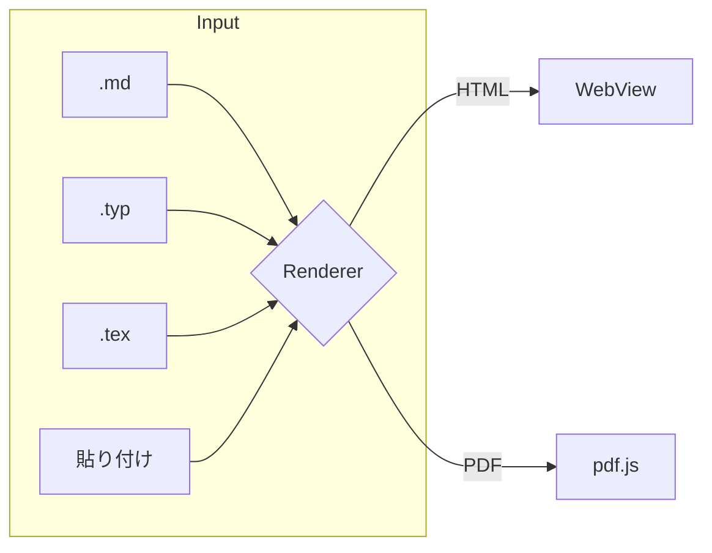
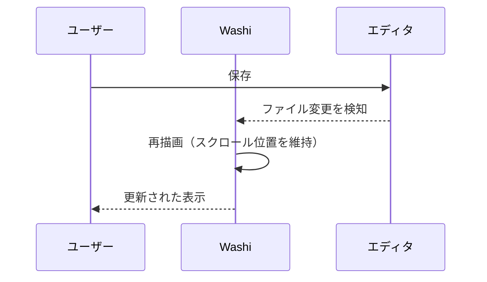
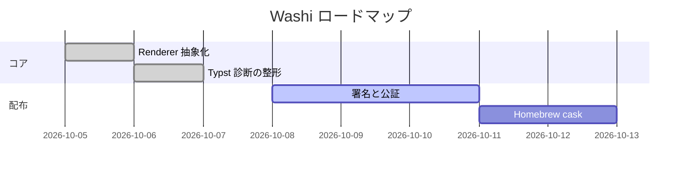

# Washi ショーケース

和紙のように静かに読める viewer です。このファイルは **Markdown の主要機能** を一通り使っています。
別の例へのリンク: [Typst レポート](report.typ) · [LaTeX 論文](paper.tex) · [Mermaid 図](architecture.mmd)（クリックで Washi 内で開きます）。
外部リンク: <https://typst.app> はブラウザで開きます。

## 1. 文章とインライン要素

日本語と English が混在する段落でも、行間と禁則は崩れません。**強調**、*斜体*、~~取り消し~~、`inline code`、上付き x^2^、
自動リンク https://example.com、脚注[^note] を使えます。価格の \$5 や \$10 はバックスラッシュで数式と区別でき、$E = mc^2$ は数式になります。

> 引用は少し色を落として表示します。
>
> > 入れ子の引用もこの通り。

[^note]: 脚注は文末にまとめられ、本文へ戻るリンクが付きます。

## 2. リストとタスク

1. 手順その 1
   - 入れ子の箇条書き
   - もう一つ
     1. さらに入れ子の番号付き
     2. 二つ目
2. 手順その 2

- [x] ファイルを開く
- [x] 保存時に自動で再描画
- [ ] Quick Look 拡張（未実装）

用語
: 定義リストも使えます。

## 3. 表

| 形式 | 描画 | 速度 | 備考 |
|:-----|:----:|-----:|------|
| Markdown | HTML | 即時 | KaTeX・Mermaid 対応 |
| Typst | PDF | ~50 ms | `@preview` パッケージ可 |
| LaTeX | PDF | ~1 s | tectonic / latexmk |
| Mermaid | SVG | 即時 | 図はクリックで拡大 |

## 4. 数式

インライン: $\int_0^1 x^2\,dx = \tfrac13$、$\sum_{k=1}^{n} k = \frac{n(n+1)}{2}$。

$$
\begin{aligned}
\nabla \cdot \mathbf{E} &= \frac{\rho}{\varepsilon_0} \\
\nabla \times \mathbf{B} &= \mu_0 \mathbf{J} + \mu_0 \varepsilon_0 \frac{\partial \mathbf{E}}{\partial t}
\end{aligned}
$$

$$
\hat f(\xi) = \int_{-\infty}^{\infty} f(x)\, e^{-2\pi i x \xi}\, dx
\qquad
\begin{pmatrix} a & b \\ c & d \end{pmatrix}^{-1} = \frac{1}{ad-bc}\begin{pmatrix} d & -b \\ -c & a \end{pmatrix}
$$

## 5. コード

```rust
use std::path::Path;

pub trait Renderer: Sync {
    fn extensions(&self) -> &'static [&'static str];
    fn render(&self, path: &Path) -> Result<Output, String>;
}
```

```typescript
type Output = { kind: "html"; html: string } | { kind: "pdf"; bytes: Uint8Array };
const decode = (wire: Uint8Array): Output =>
  wire[0] === 0 ? { kind: "html", html: new TextDecoder().decode(wire.subarray(1)) } : { kind: "pdf", bytes: wire.subarray(1) };
```

```python
from pathlib import Path

def render(path: Path) -> str:
    # 日本語コメントも崩れません
    return path.read_text(encoding="utf-8")
```

```bash
brew install --cask washi && washi examples/showcase.md examples/report.typ
```

```diff
- fn render(path: &str)
+ fn render(path: &Path) -> Result<Output, String>
```

## 6. 図（クリックで拡大）







## 7. 画像

相対パスの画像は自動で埋め込まれます。


## 8. 注意書き

> [!NOTE]
> 補足情報はこのように表示されます。

> [!TIP]
> 貼り付け (⌘V) でも、ファイルのドロップでも開けます。

> [!WARNING]
> 生の HTML は安全のため除去されます: <script>alert(1)</script>

## 9. 右から左の文章

هذا نص عربي لاختبار اتجاه الكتابة من اليمين إلى اليسار داخل المستند.

שלום עולם — טקסט בעברית כדי לבדוק כיוון.

---

*最後に: 検索は ⌘F、ズームは ⌘+ / ⌘−、印刷は ⌘P です。*
